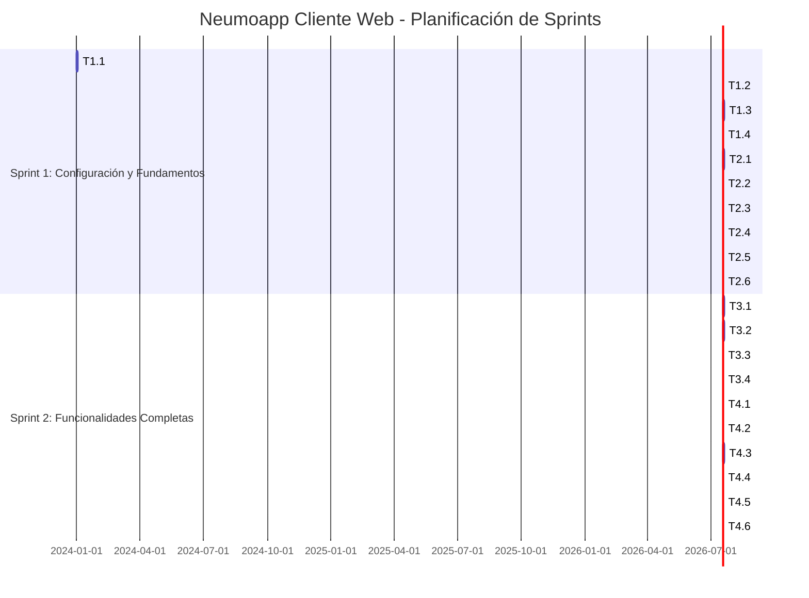

# 📅 Planificación de Sprints - Neumoapp Cliente Web

## 📋 Descripción del Proyecto

**Neumoapp Cliente Web** es una aplicación React desarrollada con Vite que permite a los pacientes gestionar sus citas médicas. El sistema incluye autenticación JWT, dashboard personalizado, sistema de reserva de citas con calendario interactivo, gestión de hospitales y especialidades, y funcionalidades de reagendamiento y cancelación.

### 🎯 Objetivos Principales
- Proporcionar una interfaz moderna y responsiva para la gestión de citas médicas
- Integrar con la API REST de Neumoapp (FastAPI)
- Implementar flujos completos de autenticación, reserva y gestión de citas
- Garantizar una experiencia de usuario fluida y accesible

### 👥 Equipo
- **1 Desarrollador Frontend** (React/Vite)
- **1 Desarrollador Backend** (FastAPI) - Trabajo paralelo

### ⏱️ Duración Total
- **4 semanas** (2 sprints de 2 semanas cada uno)

---

## 📊 Timeline General

```
Sprint 1: Configuración y Fundamentos
├── Semana 1: Setup y Autenticación
└── Semana 2: Dashboard y Componentes Base

Sprint 2: Funcionalidades Completas
├── Semana 3: Sistema de Reserva y Calendario
└── Semana 4: Reagendamiento y Refinamientos
```

---

## 🚀 Sprint 1: Configuración y Fundamentos (Semanas 1-2)

### 📅 Duración: 2 semanas
### 🎯 Objetivo: Establecer la base del proyecto y funcionalidades core

---

### 📆 Semana 1: Setup y Autenticación

#### **Tarea 1.1: Configuración Inicial del Proyecto**
- **Duración**: 2 días
- **Descripción**: 
  - Inicializar proyecto React con Vite
  - Configurar Tailwind CSS y PostCSS
  - Configurar ESLint
  - Estructurar carpetas y archivos base
  - Configurar variables de entorno
- **Entregables**:
  - Proyecto Vite funcionando
  - Tailwind CSS configurado
  - Estructura de carpetas definida
  - `.gitignore` y archivos de configuración

#### **Tarea 1.2: Configuración de Servicios API**
- **Duración**: 1 día
- **Descripción**:
  - Configurar cliente Axios
  - Implementar interceptores para JWT
  - Crear servicio base de API (`api.service.js`)
  - Configurar manejo de errores
- **Entregables**:
  - Cliente Axios configurado
  - Interceptores funcionando
  - Manejo de errores implementado

#### **Tarea 1.3: Sistema de Autenticación**
- **Duración**: 2 días
- **Descripción**:
  - Crear `AuthContext` con React Context API
  - Implementar servicio de autenticación (`auth.service.js`)
  - Crear página de Login
  - Implementar almacenamiento de token en localStorage
  - Manejar verificación automática de sesión
- **Entregables**:
  - Context de autenticación funcionando
  - Página de login completa
  - Login/logout implementados
  - Persistencia de sesión

#### **Tarea 1.4: Sistema de Rutas y Protección**
- **Duración**: 1 día
- **Descripción**:
  - Configurar React Router DOM
  - Crear componente `ProtectedRoute`
  - Definir rutas principales (login, dashboard, etc.)
  - Implementar redirecciones automáticas
- **Entregables**:
  - Sistema de rutas configurado
  - Rutas protegidas funcionando
  - Redirecciones implementadas

---

### 📆 Semana 2: Dashboard y Componentes Base

#### **Tarea 2.1: Componentes UI Base**
- **Duración**: 2 días
- **Descripción**:
  - Crear componente `Button` con variantes
  - Crear componente `Input` con validación
  - Crear componente `Select` dropdown
  - Crear componente `Card` contenedor
  - Crear componente `LoadingSpinner`
  - Aplicar estilos consistentes con Tailwind
- **Entregables**:
  - 5 componentes UI reutilizables
  - Estilos consistentes
  - Documentación de uso

#### **Tarea 2.2: Layout y Navegación**
- **Duración**: 1 día
- **Descripción**:
  - Crear componente `Navbar` responsive
  - Crear componente `MainLayout`
  - Implementar menú hamburguesa para móvil
  - Agregar información de usuario y logout
- **Entregables**:
  - Navbar responsive
  - Layout principal reutilizable
  - Navegación funcional

#### **Tarea 2.3: Servicios de Datos**
- **Duración**: 1 día
- **Descripción**:
  - Crear servicio de citas (`appointment.service.js`)
  - Crear servicio de hospitales (`hospital.service.js`)
  - Crear servicio de especialidades (`specialty.service.js`)
  - Crear servicio de consultorios (`consultationRoom.service.js`)
  - Crear servicio de horarios (`slot.service.js`)
- **Entregables**:
  - 5 servicios API implementados
  - Métodos CRUD básicos

#### **Tarea 2.4: Custom Hooks**
- **Duración**: 1 día
- **Descripción**:
  - Crear hook `useAppointments`
  - Crear hook `useHospitals`
  - Crear hook `useSpecialties`
  - Crear hook `useUpcomingAppointments`
  - Implementar manejo de estado y loading
- **Entregables**:
  - 4 custom hooks funcionando
  - Manejo de estado consistente

#### **Tarea 2.5: Dashboard Básico**
- **Duración**: 1 día
- **Descripción**:
  - Crear página `Dashboard.jsx`
  - Integrar hook `useUpcomingAppointments`
  - Mostrar próximas citas (hasta 5)
  - Implementar estados de carga y error
  - Diseño responsive
- **Entregables**:
  - Dashboard funcional
  - Visualización de citas próximas
  - Estados de UI implementados

#### **Tarea 2.6: Utilidades y Configuración**
- **Duración**: 1 día
- **Descripción**:
  - Crear utilidades de fechas (`dateUtils.js`)
  - Crear utilidades de validación (`validators.js`)
  - Configurar constantes (`constants.js`)
  - Configurar endpoints de API (`api.config.js`)
  - Configurar feriados estáticos (`holidays.js`)
- **Entregables**:
  - Utilidades de fechas y validación
  - Configuración centralizada
  - Lista de feriados peruanos

---

## 🎯 Sprint 2: Funcionalidades Completas (Semanas 3-4)

### 📅 Duración: 2 semanas
### 🎯 Objetivo: Completar funcionalidades principales y refinamientos

---

### 📆 Semana 3: Sistema de Reserva y Calendario

#### **Tarea 3.1: Formulario Multi-Step de Reserva (Parte 1)**
- **Duración**: 2 días
- **Descripción**:
  - Crear página `BookAppointment.jsx`
  - Implementar selección de hospital
  - Implementar selección de especialidad (basada en hospital)
  - Implementar selección de consultorio
  - Implementar selección de turno (mañana/tarde)
  - Diseño de pasos con indicadores visuales
- **Entregables**:
  - Formulario multi-step estructurado
  - 4 primeros pasos funcionando
  - Validación de campos

#### **Tarea 3.2: Componente de Calendario**
- **Duración**: 2 días
- **Descripción**:
  - Crear componente `CalendarPicker`
  - Implementar navegación de meses
  - Bloquear fechas pasadas
  - Bloquear fines de semana
  - Bloquear feriados (usando `holidays.js`)
  - Visualización de feriados con tooltip
  - Normalización de fechas para evitar problemas de timezone
- **Entregables**:
  - Calendario interactivo completo
  - Bloqueo de fechas no disponibles
  - Manejo correcto de timezones

#### **Tarea 3.3: Selección de Horarios**
- **Duración**: 1 día
- **Descripción**:
  - Crear componente `TimeSlotPicker`
  - Integrar con endpoint de slots disponibles
  - Mostrar horarios disponibles/ocupados
  - Permitir selección de slot
  - Actualizar slots al cambiar fecha/turno
- **Entregables**:
  - Selector de horarios funcional
  - Integración con API de slots
  - Actualización dinámica

#### **Tarea 3.4: Completar Formulario de Reserva**
- **Duración**: 1 día
- **Descripción**:
  - Agregar campo de motivo de consulta
  - Implementar validación completa
  - Integrar creación de cita con API
  - Manejar errores y éxito
  - Redirección a dashboard después de crear
- **Entregables**:
  - Formulario completo funcional
  - Creación de citas implementada
  - Feedback al usuario

---

### 📆 Semana 4: Reagendamiento y Refinamientos

#### **Tarea 4.1: Visualización de Todas las Citas**
- **Duración**: 1 día
- **Descripción**:
  - Crear página `MyAppointments.jsx`
  - Listar todas las citas del usuario
  - Mostrar información detallada (fecha, hora, especialidad, estado)
  - Implementar diseño responsive
  - Manejar estados vacíos y errores
- **Entregables**:
  - Página de historial de citas
  - Visualización completa de información

#### **Tarea 4.2: Funcionalidad de Cancelación**
- **Duración**: 1 día
- **Descripción**:
  - Agregar botón "Anular" en cards de citas
  - Implementar diálogo de confirmación
  - Integrar con endpoint de cancelación
  - Actualizar lista después de cancelar
  - Mostrar feedback al usuario
- **Entregables**:
  - Cancelación de citas implementada
  - Confirmación antes de cancelar
  - Actualización de UI

#### **Tarea 4.3: Funcionalidad de Reagendamiento**
- **Duración**: 2 días
- **Descripción**:
  - Agregar botón "Reagendar" en cards de citas
  - Detectar modo de reagendamiento en `BookAppointment`
  - Cargar datos de cita original
  - Pre-llenar formulario con datos originales
  - Mostrar información de cita original
  - Implementar lógica de reagendamiento:
    - Crear nueva cita
    - Actualizar estado a "rescheduled"
    - Eliminar cita original
  - Agregar estado "rescheduled" a constantes
- **Entregables**:
  - Reagendamiento completo funcional
  - Flujo de usuario claro
  - Manejo correcto de estados

#### **Tarea 4.4: Diálogo de Confirmación**
- **Duración**: 1 día
- **Descripción**:
  - Crear componente `ConfirmDialog` reutilizable
  - Integrar en flujo de reserva de citas
  - Mostrar información de la cita antes de confirmar
  - Diferentes mensajes para cita nueva vs reagendamiento
  - Diseño modal con backdrop
- **Entregables**:
  - Diálogo de confirmación implementado
  - Integrado en flujo de reserva
  - Mensajes personalizados

#### **Tarea 4.5: Refinamientos y Correcciones**
- **Duración**: 1 día
- **Descripción**:
  - Corregir problemas de timezone en fechas
  - Ajustar tamaño del calendario
  - Mejorar responsive design
  - Optimizar llamadas API (evitar dobles llamadas)
  - Corregir orden de días en calendario
  - Mejorar manejo de errores
  - Ajustar estilos y espaciados
- **Entregables**:
  - Bugs corregidos
  - Mejoras de UX implementadas
  - Código optimizado

#### **Tarea 4.6: Testing y Documentación Final**
- **Duración**: 1 día
- **Descripción**:
  - Probar todos los flujos de usuario
  - Verificar responsive en diferentes dispositivos
  - Documentar componentes principales
  - Revisar y limpiar código
  - Preparar para deploy
- **Entregables**:
  - Aplicación probada y funcional
  - Documentación actualizada
  - Código limpio y listo

---

## 📊 Diagrama de Gantt



---

## 📈 Resumen de Tareas por Sprint

### Sprint 1: Configuración y Fundamentos
- **Total de tareas**: 10
- **Duración**: 14 días (2 semanas)
- **Entregables principales**:
  - Proyecto configurado y funcionando
  - Autenticación completa
  - Componentes UI base
  - Dashboard básico
  - Servicios API implementados

### Sprint 2: Funcionalidades Completas
- **Total de tareas**: 10
- **Duración**: 14 días (2 semanas)
- **Entregables principales**:
  - Sistema completo de reserva de citas
  - Calendario interactivo con feriados
  - Reagendamiento y cancelación
  - Diálogo de confirmación
  - Aplicación completa y probada

---

## 🎯 Criterios de Aceptación por Sprint

### ✅ Sprint 1 - Criterios de Aceptación
- [ ] Usuario puede registrarse e iniciar sesión
- [ ] Token JWT se almacena y persiste correctamente
- [ ] Rutas protegidas funcionan correctamente
- [ ] Dashboard muestra próximas citas
- [ ] Componentes UI son reutilizables y consistentes
- [ ] Servicios API están implementados y funcionando
- [ ] Aplicación es responsive en móvil y desktop

### ✅ Sprint 2 - Criterios de Aceptación
- [ ] Usuario puede agendar una cita completa
- [ ] Calendario bloquea fechas no disponibles (pasadas, fines de semana, feriados)
- [ ] Usuario puede ver todas sus citas
- [ ] Usuario puede cancelar citas con confirmación
- [ ] Usuario puede reagendar citas correctamente
- [ ] Diálogo de confirmación funciona en reserva
- [ ] Fechas se muestran correctamente sin problemas de timezone
- [ ] Aplicación está libre de bugs críticos

---

## 🔄 Dependencias con Backend

### Sprint 1
- **T1.2, T1.3**: Requiere endpoints de autenticación (`/auth/register`, `/auth/login`, `/auth/me`)
- **T2.3, T2.4, T2.5**: Requiere endpoints de citas (`/appointments/upcoming`, `/appointments/my-appointments`)

### Sprint 2
- **T3.1, T3.2, T3.3, T3.4**: Requiere endpoints completos:
  - `/hospitals/`
  - `/hospitals/{id}/specialties`
  - `/consultation-rooms/by-hospital-and-specialty`
  - `/slots/available`
  - `POST /appointments/`
- **T4.2**: Requiere `DELETE /appointments/{id}`
- **T4.3**: Requiere `PATCH /appointments/{id}` y `DELETE /appointments/{id}`

---

## 📝 Notas Adicionales

### Consideraciones Técnicas
- **Timezone**: Se implementó normalización de fechas para evitar problemas de timezone
- **Feriados**: Lista estática de feriados peruanos para 2025
- **Responsive**: Diseño mobile-first con Tailwind CSS
- **Performance**: Optimización de llamadas API con custom hooks y memoización

### Mejoras Futuras (Fuera del Scope)
- Tests unitarios y de integración
- Internacionalización (i18n)
- Notificaciones push
- Filtros avanzados en historial de citas
- Búsqueda de citas
- Exportación de citas a calendario

---

## 👥 Coordinación con Backend

### Comunicación Necesaria
- **Inicio Sprint 1**: Confirmar endpoints de autenticación disponibles
- **Inicio Sprint 2**: Confirmar endpoints de reserva y gestión disponibles
- **Durante desarrollo**: Coordinar cambios en estructura de respuestas API
- **Final Sprint 2**: Validar integración completa frontend-backend

### Endpoints Críticos
1. **Autenticación**: `/auth/register`, `/auth/login`, `/auth/me`
2. **Citas**: `/appointments/upcoming`, `/appointments/my-appointments`, `POST /appointments/`
3. **Reserva**: `/hospitals/`, `/slots/available`, `/consultation-rooms/by-hospital-and-specialty`
4. **Gestión**: `PATCH /appointments/{id}`, `DELETE /appointments/{id}`

---

**Última actualización**: 2025-01-XX  
**Versión del documento**: 1.0

