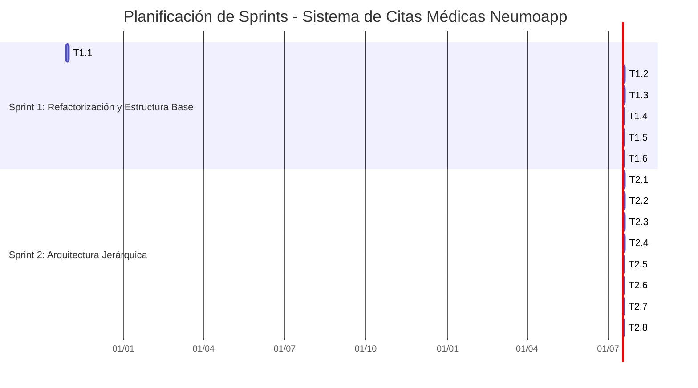
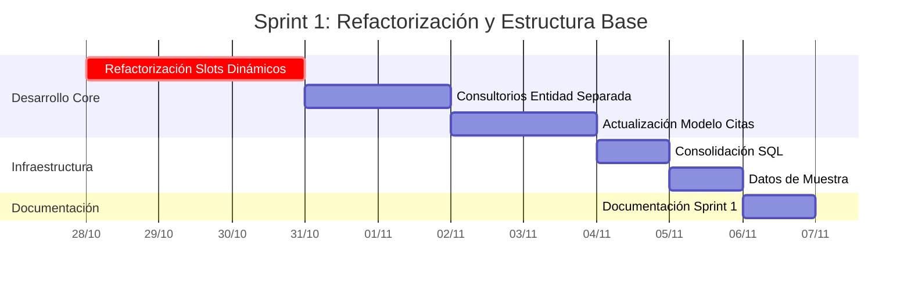
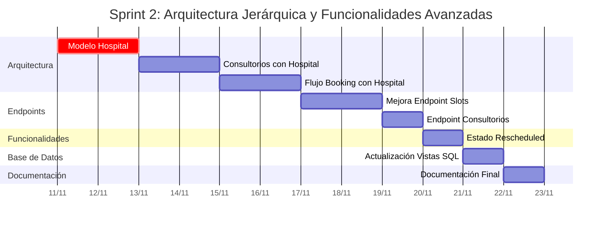
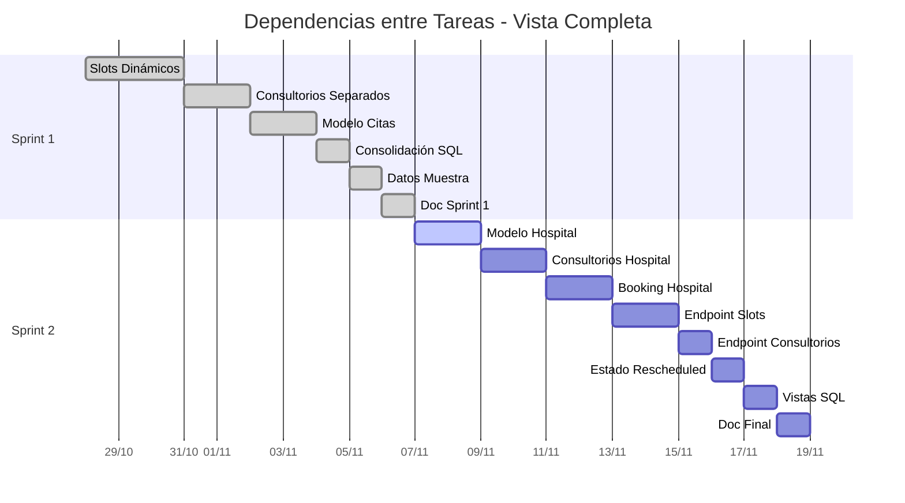

# 📋 Planificación de Sprints - Sistema de Citas Médicas Neumoapp

## 📊 Resumen del Proyecto

**Proyecto:** Sistema de Gestión de Citas Médicas con Arquitectura Multi-Hospital  
**Duración Total:** 4 semanas (2 sprints de 2 semanas cada uno)  
**Equipo:** 1 Desarrollador Backend  
**Stack Tecnológico:** FastAPI, PostgreSQL, SQLAlchemy, Pydantic, JWT

---

## 🎯 Sprint 1: Refactorización y Estructura Base (Semanas 1-2)

### 📅 Timeline
- **Inicio:** Semana 1, Día 1
- **Fin:** Semana 2, Día 10
- **Duración:** 10 días hábiles

### 📝 Descripción del Sprint

Este sprint se enfoca en la refactorización completa del sistema de citas, migrando de un modelo de horarios pre-generados a un sistema de slots dinámicos, e implementando la estructura base de consultorios con relaciones M:N. Se establecen las bases para la arquitectura jerárquica que se completará en el Sprint 2.

### ✅ Tareas del Sprint 1

#### **Tarea 1.1: Refactorización del Sistema de Horarios a Slots Dinámicos**
**Prioridad:** Alta  
**Estimación:** 3 días  
**Descripción:**  
Refactorizar completamente el sistema de citas médicas para eliminar la tabla `schedules` y generar slots de tiempo dinámicamente. Implementar `SlotService` que genere horarios en tiempo real basándose en reglas de negocio (20 minutos por cita, turnos mañana/tarde, solo días hábiles).

**Entregables:**
- Eliminación del modelo `Schedule` y tabla `schedules`
- Creación de `SlotService` con lógica de generación dinámica
- Actualización de `Appointment` model para usar fecha, hora y turno directamente
- Validación de disponibilidad en tiempo real
- Actualización de repositorios y servicios relacionados

**Criterios de Aceptación:**
- ✅ Los slots se generan dinámicamente al consultar disponibilidad
- ✅ No existe tabla `schedules` en la base de datos
- ✅ La validación de disponibilidad funciona correctamente
- ✅ Los slots respetan horarios de turno (mañana: 8:00-13:00, tarde: 14:00-18:00)

---

#### **Tarea 1.2: Implementación de Consultorios como Entidad Separada**
**Prioridad:** Alta  
**Estimación:** 2 días  
**Descripción:**  
Crear la tabla `consultation_rooms` como entidad independiente con relación M:N con `specialties`. Implementar modelos, schemas, repositorios, servicios y controladores completos para la gestión de consultorios.

**Entregables:**
- Modelo `ConsultationRoom` con SQLAlchemy
- Schemas Pydantic (Create, Update, Response, WithSpecialties)
- `ConsultationRoomRepository` con métodos CRUD
- `ConsultationRoomService` con lógica de negocio
- `ConsultationRoomController` con endpoints REST
- Relación M:N con `Specialty` vía tabla `specialty_consultation_rooms`

**Criterios de Aceptación:**
- ✅ Un consultorio puede estar asignado a múltiples especialidades
- ✅ Una especialidad puede tener múltiples consultorios
- ✅ Endpoints CRUD funcionan correctamente
- ✅ Validaciones de negocio implementadas

---

#### **Tarea 1.3: Actualización del Modelo de Citas y Validaciones**
**Prioridad:** Alta  
**Estimación:** 2 días  
**Descripción:**  
Actualizar el modelo `Appointment` para trabajar con la nueva estructura de slots dinámicos y consultorios. Implementar validaciones de negocio para asegurar que las citas solo se puedan agendar en slots disponibles y en consultorios asignados a la especialidad correcta.

**Entregables:**
- Actualización de `Appointment` model (fecha, hora, turno, consultorio)
- Actualización de `AppointmentService` con nuevas validaciones
- Validación de que el consultorio pertenece a la especialidad
- Validación de disponibilidad de slot antes de crear cita
- Actualización de schemas y endpoints

**Criterios de Aceptación:**
- ✅ No se pueden crear citas en slots ocupados
- ✅ No se pueden asignar consultorios a especialidades incorrectas
- ✅ Las validaciones se ejecutan antes de crear la cita
- ✅ Mensajes de error claros y descriptivos

---

#### **Tarea 1.4: Consolidación de Scripts SQL**
**Prioridad:** Media  
**Estimación:** 1 día  
**Descripción:**  
Consolidar todos los archivos SQL dispersos en un único archivo maestro `database_schema.sql` que contenga el esquema completo de la base de datos, incluyendo tablas, índices, constraints, vistas y funciones. Eliminar archivos SQL innecesarios.

**Entregables:**
- Archivo único `scripts/database_schema.sql` con esquema completo
- Eliminación de archivos SQL redundantes
- Documentación del esquema en comentarios SQL
- Vistas y funciones actualizadas

**Criterios de Aceptación:**
- ✅ Un solo archivo SQL contiene todo el esquema
- ✅ El esquema se puede ejecutar desde cero sin errores
- ✅ Todas las vistas y funciones están incluidas
- ✅ Archivos SQL redundantes eliminados

---

#### **Tarea 1.5: Generación de Datos de Muestra Mejorados**
**Prioridad:** Media  
**Estimación:** 1 día  
**Descripción:**  
Mejorar el script `init_db.py` para generar datos de muestra más completos y realistas. Incluir más pacientes (15 en lugar de 5), más citas (40 en lugar de 5), y distribuir las citas a lo largo de la próxima semana con diferentes estados y turnos.

**Entregables:**
- Actualización de `init_db.py` con más datos de muestra
- 15 pacientes con datos variados
- 40 citas distribuidas en la próxima semana
- Citas con diferentes estados (pending, confirmed, cancelled)
- Citas en diferentes turnos y consultorios

**Criterios de Aceptación:**
- ✅ Se generan 15 pacientes con datos realistas
- ✅ Se generan 40 citas distribuidas en la próxima semana
- ✅ Las citas cubren diferentes escenarios (estados, turnos, consultorios)
- ✅ El script se ejecuta sin errores

---

#### **Tarea 1.6: Actualización de Documentación y README**
**Prioridad:** Baja  
**Estimación:** 1 día  
**Descripción:**  
Actualizar la documentación del proyecto para reflejar los cambios realizados. Actualizar README con nuevos endpoints, flujo de booking actualizado, y ejemplos de uso.

**Entregables:**
- README.md actualizado con nuevos endpoints
- Documentación de flujo de booking actualizado
- Ejemplos de uso actualizados
- Documentación de arquitectura

**Criterios de Aceptación:**
- ✅ README refleja todos los cambios del sprint
- ✅ Ejemplos de uso funcionan correctamente
- ✅ Documentación está actualizada y clara

---

### 📊 Métricas del Sprint 1

- **Story Points Totales:** 10 puntos
- **Días de Desarrollo:** 10 días
- **Endpoints Implementados:** ~15 endpoints
- **Modelos Creados/Modificados:** 3 modelos principales
- **Archivos SQL Consolidados:** De múltiples archivos a 1 archivo maestro

---

## 🎯 Sprint 2: Arquitectura Jerárquica y Funcionalidades Avanzadas (Semanas 3-4)

### 📅 Timeline
- **Inicio:** Semana 3, Día 1
- **Fin:** Semana 4, Día 10
- **Duración:** 10 días hábiles

### 📝 Descripción del Sprint

Este sprint implementa la arquitectura jerárquica completa Hospital → Especialidades → Consultorios, permitiendo que los pacientes seleccionen primero el hospital, luego la especialidad, y finalmente el consultorio. Se mejoran los endpoints de disponibilidad y se agregan funcionalidades adicionales como el estado "rescheduled".

### ✅ Tareas del Sprint 2

#### **Tarea 2.1: Implementación de Modelo Hospital**
**Prioridad:** Alta  
**Estimación:** 2 días  
**Descripción:**  
Crear el modelo `Hospital` con relación M:N con `Specialty`. Implementar la estructura completa (modelo, schemas, repositorio, servicio, controlador) para gestionar hospitales y su relación con especialidades.

**Entregables:**
- Modelo `Hospital` con SQLAlchemy
- Tabla de asociación `hospital_specialties` (M:N)
- Schemas Pydantic (Create, Update, Response, WithStats, WithSpecialties)
- `HospitalRepository` con métodos para gestionar especialidades
- `HospitalService` con lógica de negocio
- `HospitalController` con endpoints REST completos
- Endpoints para asignar/remover especialidades a hospitales

**Criterios de Aceptación:**
- ✅ Un hospital puede ofrecer múltiples especialidades
- ✅ Una especialidad puede estar en múltiples hospitales
- ✅ Endpoints CRUD funcionan correctamente
- ✅ Endpoints de gestión de especialidades funcionan

---

#### **Tarea 2.2: Actualización de Consultorios con Hospital**
**Prioridad:** Alta  
**Estimación:** 2 días  
**Descripción:**  
Modificar el modelo `ConsultationRoom` para incluir `hospital_id` (relación 1:N con Hospital). Actualizar todos los servicios, repositorios y controladores para reflejar esta nueva relación. Actualizar el flujo de booking para incluir hospital.

**Entregables:**
- Actualización de `ConsultationRoom` model con `hospital_id`
- Actualización de `ConsultationRoomRepository` con métodos por hospital
- Actualización de `ConsultationRoomService` con validaciones de hospital
- Actualización de schemas para incluir `hospital_id`
- Actualización de `init_db.py` para asignar consultorios a hospitales
- Actualización de script SQL con foreign key

**Criterios de Aceptación:**
- ✅ Cada consultorio pertenece a un hospital
- ✅ Las validaciones verifican que el consultorio pertenece al hospital correcto
- ✅ El flujo de booking incluye selección de hospital
- ✅ Los datos de muestra reflejan la nueva estructura

---

#### **Tarea 2.3: Actualización del Flujo de Booking con Hospital**
**Prioridad:** Alta  
**Estimación:** 2 días  
**Descripción:**  
Actualizar el flujo completo de booking para que los pacientes primero seleccionen un hospital, luego una especialidad, y finalmente un consultorio. Actualizar `SlotService` y `AppointmentService` para validar la jerarquía Hospital → Especialidad → Consultorio.

**Entregables:**
- Actualización de `SlotService.get_available_slots()` para filtrar por hospital
- Actualización de `AppointmentService.book_appointment()` con validación de hospital
- Validación de que el hospital ofrece la especialidad seleccionada
- Validación de que el consultorio pertenece al hospital y especialidad
- Actualización de endpoints para incluir `hospital_id` en parámetros

**Criterios de Aceptación:**
- ✅ El flujo de booking requiere seleccionar hospital primero
- ✅ Las validaciones verifican la jerarquía completa
- ✅ Los slots se filtran correctamente por hospital
- ✅ No se pueden crear citas con combinaciones inválidas

---

#### **Tarea 2.4: Mejora del Endpoint de Slots Disponibles**
**Prioridad:** Alta  
**Estimación:** 1.5 días  
**Descripción:**  
Mejorar el endpoint `/slots/available` para incluir `room_id` como parámetro opcional de filtrado y modificar la respuesta para devolver TODOS los slots (disponibles y ocupados) con un campo `available: boolean` que indique el estado de cada slot.

**Entregables:**
- Actualización de `SlotService.get_available_slots()` para incluir `room_id` opcional
- Modificación de la lógica para devolver todos los slots (no solo disponibles)
- Agregar campo `available: boolean` a cada slot en la respuesta
- Actualización de `SlotController` con nuevo parámetro y documentación
- Actualización de schemas de respuesta

**Criterios de Aceptación:**
- ✅ El endpoint acepta `room_id` como parámetro opcional
- ✅ La respuesta incluye todos los slots (disponibles y ocupados)
- ✅ Cada slot tiene el campo `available: true/false`
- ✅ El filtrado por `room_id` funciona correctamente

---

#### **Tarea 2.5: Endpoint de Consultorios por Hospital y Especialidad**
**Prioridad:** Media  
**Estimación:** 1 día  
**Descripción:**  
Crear endpoint `GET /consultation-rooms/by-hospital-and-specialty` que liste los consultorios disponibles para una combinación específica de hospital y especialidad. Este endpoint es útil en el flujo de booking para mostrar opciones de consultorios.

**Entregables:**
- Método en `ConsultationRoomRepository.get_by_hospital_and_specialty()`
- Método en `ConsultationRoomService.get_rooms_by_hospital_and_specialty()`
- Endpoint `GET /consultation-rooms/by-hospital-and-specialty` en controller
- Documentación del endpoint
- Validaciones de existencia de hospital y especialidad

**Criterios de Aceptación:**
- ✅ El endpoint filtra correctamente por hospital y especialidad
- ✅ Solo retorna consultorios activos
- ✅ Retorna 404 si no hay consultorios para esa combinación
- ✅ La documentación está completa

---

#### **Tarea 2.6: Implementación del Estado "rescheduled"**
**Prioridad:** Media  
**Estimación:** 1 día  
**Descripción:**  
Agregar el estado "rescheduled" al enum `AppointmentStatus` y actualizar todos los endpoints y servicios que manejan estados de citas. Actualizar el CHECK constraint en la base de datos y crear script de migración.

**Entregables:**
- Actualización de enum `AppointmentStatus` con `RESCHEDULED`
- Actualización de CHECK constraint en `database_schema.sql`
- Actualización de `SlotService` para considerar "rescheduled" como ocupado
- Actualización de `AppointmentService` para aceptar "rescheduled"
- Actualización de mensajes de error y documentación
- Script de migración SQL `migration_add_rescheduled_status.sql`
- Actualización de schemas y controladores

**Criterios de Aceptación:**
- ✅ El estado "rescheduled" es válido en todos los endpoints
- ✅ Los slots con citas "rescheduled" se marcan como ocupados
- ✅ El script de migración actualiza correctamente la BD
- ✅ La documentación refleja el nuevo estado

---

#### **Tarea 2.7: Actualización de Scripts SQL y Vistas**
**Prioridad:** Media  
**Estimación:** 1 día  
**Descripción:**  
Actualizar todas las vistas SQL y funciones para reflejar la nueva estructura jerárquica con hospitales. Crear nuevas vistas útiles como `v_hospital_specialties`, actualizar `v_consultation_rooms_with_info` para incluir hospital, y actualizar funciones relacionadas.

**Entregables:**
- Actualización de vistas existentes para incluir hospital
- Nueva vista `v_hospital_specialties`
- Actualización de `v_consultation_rooms_with_info` (antes `v_consultation_rooms_with_specialties`)
- Actualización de `v_hospitals_with_stats`
- Actualización de `v_upcoming_appointments` para incluir hospital
- Nueva función `get_hospital_specialties_rooms()`
- Script de migración para actualizar vistas

**Criterios de Aceptación:**
- ✅ Todas las vistas reflejan la nueva estructura jerárquica
- ✅ Las vistas se pueden ejecutar sin errores
- ✅ Las funciones retornan datos correctos
- ✅ El script de migración actualiza correctamente

---

#### **Tarea 2.8: Actualización Completa de Documentación**
**Prioridad:** Baja  
**Estimación:** 0.5 días  
**Descripción:**  
Actualizar completamente el README y toda la documentación del proyecto para reflejar la nueva arquitectura jerárquica, el nuevo flujo de booking, y todos los endpoints actualizados.

**Entregables:**
- README.md completamente actualizado
- Documentación del nuevo flujo de booking (Hospital → Especialidad → Consultorio)
- Ejemplos de uso actualizados con la nueva estructura
- Documentación de todos los nuevos endpoints
- Diagramas de arquitectura actualizados

**Criterios de Aceptación:**
- ✅ README refleja completamente la nueva arquitectura
- ✅ Los ejemplos de uso funcionan con la nueva estructura
- ✅ La documentación está completa y clara
- ✅ Los diagramas están actualizados

---

### 📊 Métricas del Sprint 2

- **Story Points Totales:** 10 puntos
- **Días de Desarrollo:** 10 días
- **Endpoints Implementados:** ~13 endpoints nuevos/actualizados
- **Modelos Creados/Modificados:** 1 modelo nuevo, 2 modelos modificados
- **Vistas SQL Actualizadas:** 5+ vistas y funciones

---

## 📈 Resumen General del Proyecto

### Totales del Proyecto
- **Duración Total:** 4 semanas (20 días hábiles)
- **Story Points Totales:** 20 puntos
- **Endpoints Totales:** ~28 endpoints
- **Modelos de Base de Datos:** 6 modelos principales
- **Arquitectura:** Clean Architecture con 5 capas

### Entregables Finales
- ✅ Sistema completo de gestión de citas médicas
- ✅ Arquitectura jerárquica Hospital → Especialidades → Consultorios
- ✅ Sistema de slots dinámicos sin pre-generación
- ✅ API REST completa con 28 endpoints
- ✅ Base de datos PostgreSQL con vistas y funciones avanzadas
- ✅ Documentación completa y actualizada
- ✅ Scripts de migración para actualizaciones de BD
- ✅ Datos de muestra completos para testing

### Tecnologías Utilizadas
- **Backend:** FastAPI (Python)
- **Base de Datos:** PostgreSQL
- **ORM:** SQLAlchemy
- **Validación:** Pydantic
- **Autenticación:** JWT (JSON Web Tokens)
- **Documentación:** Swagger UI (automático)

---

## 📅 Timeline Visual - Diagrama de Gantt

> **Nota:** Los diagramas de Gantt a continuación muestran la planificación visual de las tareas. Las fechas son referenciales y pueden ajustarse según necesidades del proyecto. Las tareas marcadas como `crit` (críticas) son las más importantes del sprint.

### Diagrama de Gantt Completo

### Vista Detallada por Sprint

#### Sprint 1 - Semanas 1-2 (10 días)

#### Sprint 2 - Semanas 3-4 (10 días)

### Vista de Dependencias entre Tareas

---

## 🎯 Criterios de Éxito del Proyecto

1. ✅ **Funcionalidad Completa:** Todos los endpoints funcionan correctamente
2. ✅ **Arquitectura Limpia:** Código organizado siguiendo Clean Architecture
3. ✅ **Validaciones Robustas:** Todas las validaciones de negocio implementadas
4. ✅ **Documentación Completa:** README y documentación actualizados
5. ✅ **Base de Datos Optimizada:** Vistas, índices y constraints correctos
6. ✅ **Datos de Prueba:** Scripts de inicialización con datos realistas
7. ✅ **Migraciones:** Scripts de migración para actualizaciones futuras

---

## 📝 Notas Adicionales

- **Dependencias entre Tareas:** Las tareas del Sprint 1 deben completarse antes de iniciar el Sprint 2, ya que la arquitectura jerárquica depende de la estructura base.
- **Testing:** Se recomienda realizar testing manual de cada endpoint después de cada tarea.
- **Code Review:** Aunque hay un solo desarrollador, se recomienda revisar el código antes de marcar tareas como completadas.
- **Documentación:** Mantener la documentación actualizada durante el desarrollo, no solo al final.

---

**Última Actualización:** Octubre 2024  
**Versión del Documento:** 1.0

