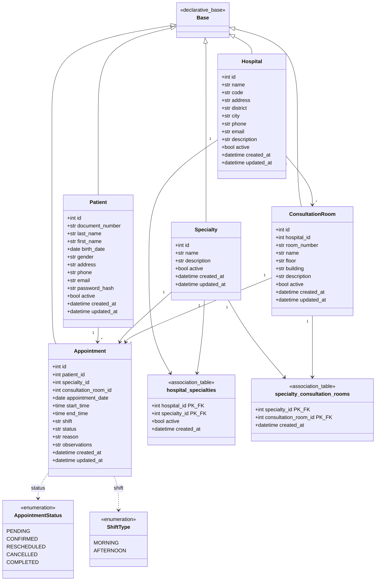
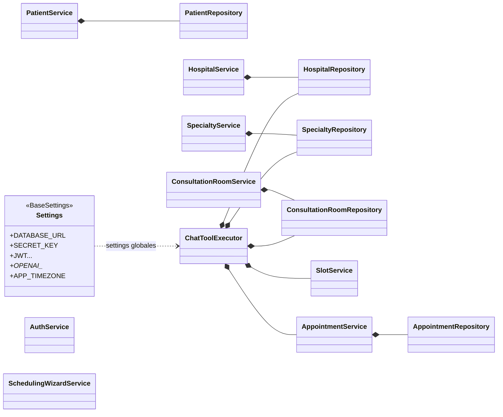

# Diagrama de clases — Neumoapp (backend)

Documentación del modelo de dominio persistido con SQLAlchemy y de la capa de servicios/repositorios que lo usa. Código fuente bajo `service/app/`.

## 1. Modelo de dominio (ORM)

Entidades en `app/models/`. Todas heredan de `Base` definido en `app/database/base.py` (metadata SQLAlchemy).

### Relaciones

| Relación | Tipo | Detalle |
|----------|------|---------|
| Patient ↔ Appointment | 1:N | Un paciente tiene muchas citas. |
| Specialty ↔ Appointment | 1:N | Una especialidad en muchas citas. |
| ConsultationRoom ↔ Appointment | 1:N | Un consultorio en muchas citas. |
| Hospital ↔ ConsultationRoom | 1:N | Un hospital tiene muchos consultorios. |
| Hospital ↔ Specialty | N:M | Tabla de unión `hospital_specialties` (`app/models/hospital.py`). |
| Specialty ↔ ConsultationRoom | N:M | Tabla de unión `specialty_consultation_rooms` (`app/models/consultation_room.py`). |

### Notas

- En la base de datos, `appointments.status` es texto; en código existen los enums `AppointmentStatus` y `ShiftType` en `app/models/appointment.py` como referencia semántica para valores permitidos.
- Las tablas de asociación incluyen columnas extra donde aplica (por ejemplo `active` y `created_at` en `hospital_specialties`).

### Diagrama (Mermaid)

## 2. Capa de aplicación (servicios y repositorios)

Los endpoints FastAPI (`app/controllers/`) construyen servicios pasando una `Session` de SQLAlchemy. Cada servicio de dominio compone el repositorio correspondiente (`app/repositories/`). Los DTO de request/response son esquemas Pydantic en `app/schemas/` (heredan de `BaseModel`); no son entidades ORM.

### Diagrama (Mermaid)

### Chat / OpenAI

- `app/services/openai_chat_service.py`: orquestación del chat (funciones de módulo, p. ej. `run_chat`), cliente OpenAI-compatible.
- `app/services/chat_tool_executor.py`: clase `ChatToolExecutor` — ejecuta herramientas del modelo delegando en servicios y repositorios existentes.
- `app/services/scheduling_wizard_service.py`: clase `SchedulingWizardService` — flujo asistido de agendamiento.

## 3. Cómo visualizar los diagramas

- **GitHub / GitLab**: el Markdown con bloques `mermaid` suele renderizarse en la vista del repositorio.
- **VS Code / Cursor**: extensión “Markdown Preview Mermaid Support” o similar.
- **Mermaid Live Editor**: https://mermaid.live (pegar el contenido de cada bloque).

## 4. Archivos de referencia

| Área | Ruta |
|------|------|
| Modelos | `service/app/models/` |
| Esquemas API | `service/app/schemas/` |
| Repositorios | `service/app/repositories/` |
| Servicios | `service/app/services/` |
| Controladores | `service/app/controllers/` |
| Base y sesión | `service/app/database/base.py` |
| Configuración | `service/app/core/config.py` |
