# Evidencias de pruebas funcionales — Neumoapp

## Índice

1. [Propósito y audiencia](#1-propósito-y-audiencia)
2. [Control del documento](#2-control-del-documento)
3. [Alcance del sistema bajo prueba](#3-alcance-del-sistema-bajo-prueba)
4. [Glosario y convenciones](#4-glosario-y-convenciones)
5. [Ambiente, datos y herramientas](#5-ambiente-datos-y-herramientas)
6. [Cómo registrar evidencia (capturas)](#6-cómo-registrar-evidencia-capturas)
7. [Casos de prueba por módulo](#7-casos-de-prueba-por-módulo)
   - [7.1 Autenticación y sesión](#71-autenticación-y-sesión)
   - [7.2 Navegación y rutas protegidas (cliente)](#72-navegación-y-rutas-protegidas-cliente)
   - [7.3 Perfil del paciente](#73-perfil-del-paciente)
   - [7.4 Catálogo: hospitales, especialidades y consultorios](#74-catálogo-hospitales-especialidades-y-consultorios)
   - [7.5 Disponibilidad de turnos (slots)](#75-disponibilidad-de-turnos-slots)
   - [7.6 Ciclo de vida de citas](#76-ciclo-de-vida-de-citas)
   - [7.7 Reserva end-to-end en cliente web](#77-reserva-end-to-end-en-cliente-web)
   - [7.8 Asistente de chat](#78-asistente-de-chat)
   - [7.9 Contrato API, salud y documentación](#79-contrato-api-salud-y-documentación)
8. [Matriz resumen de cobertura](#8-matriz-resumen-de-cobertura)
9. [Firmas](#9-firmas)

---

## 1. Propósito y audiencia

Este documento sirve como **registro formal de pruebas funcionales** ejecutadas sobre Neumoapp: permite demostrar que los flujos críticos del negocio (autenticación, consulta de catálogo, disponibilidad, reserva y gestión de citas, y funciones auxiliares) se comportan según lo esperado en un entorno controlado.

**Audiencia típica:** responsable de calidad, product owner, auditoría académica o contrato, o equipo técnico que deba reproducir los escenarios.

**Qué no sustituye:** pruebas de carga, pruebas de seguridad exhaustivas (pentest), ni pruebas unitarias automatizadas. Pueden documentarse aparte si aplica.

---

## 2. Control del documento

| Campo | Valor |
|--------|--------|
| Proyecto | Neumoapp |
| Tipo de prueba | Funcional (caja negra / gris, manual o asistida) |
| Versión del documento | 1.1 |
| Última actualización del contenido plantilla | _Completar fecha_ |

**Historial de revisiones**

| Versión | Fecha | Autor | Descripción |
|---------|--------|--------|-------------|
| 1.0 | _Completar_ | _Completar_ | Versión inicial con tablas resumidas |
| 1.1 | _Completar_ | _Completar_ | Ampliación de casos con descripción detallada |

**Identificación del build probado**

| Ítem | Valor |
|------|--------|
| Rama Git | _Completar (ej. main, develop)_ |
| Hash de commit | _Completar_ |
| Fecha y hora de ejecución de la batería | _Completar_ |
| URL base API | _Ej. http://localhost:3000_ |
| URL base cliente web | _Ej. http://localhost:5173_ |
| Motor de base de datos | _Ej. PostgreSQL 15 (docker-compose)_ |
| Sistema operativo del ejecutor | _Completar_ |
| Navegador (si aplica UI) | _Completar + versión_ |

---

## 3. Alcance del sistema bajo prueba

**Backend (`service/`):** API REST FastAPI con capas controlador → servicio → repositorio; modelos SQLAlchemy; esquemas Pydantic. Endpoints principales documentados en `service/README.md` y en Swagger (`/docs`).

**Frontend (`clientSide/`):** aplicación React con rutas protegidas, entre otras:

| Ruta | Pantalla |
|------|-----------|
| `/login` | Inicio de sesión |
| `/dashboard` | Panel principal |
| `/agendar-cita` | Flujo de reserva |
| `/mis-citas` | Listado y gestión de citas del usuario |
| `/asistente` | Chat con asistente (depende de configuración LLM) |

**Fuera de alcance funcional de esta plantilla** (salvo que se amplíe explícitamente): paneles de administración no expuestos en el cliente actual, integraciones de pago, notificaciones por correo/SMS, y despliegue en producción.

---

## 4. Glosario y convenciones

| Término | Significado |
|---------|-------------|
| **Caso de prueba** | Escenario único con precondiciones, acciones y resultado esperado verificable. |
| **ID** | Código `PF-<ÁREA>-<NNN>` para trazabilidad y nombres de archivo de evidencia. |
| **SUT** | System Under Test: build concreto en el ambiente indicado. |
| **Token JWT** | Credencial `Bearer` devuelta por `POST /auth/login`. |
| **Turno (shift)** | Franja lógica `morning` o `afternoon` alineada con reglas de negocio de slots. |
| **Evidencia** | Captura de pantalla, exportación de Postman, o PDF que prueba la ejecución. |

**Prioridad sugerida**

| Nivel | Criterio |
|-------|-----------|
| Alta | Bloquea uso del producto o integridad de datos. |
| Media | Flujo frecuente o regla de negocio importante. |
| Baja | Comodidad, mensajes secundarios o rutas poco usadas. |

---

## 5. Ambiente, datos y herramientas

### 5.1 Datos de referencia (paciente de prueba)

Según documentación del repositorio, suele existir un paciente sembrado con:

- **Documento (DNI):** `12345678`
- **Contraseña:** `password123`

Si tu `init_db.py` o scripts de seed usan otros valores, **sustituye en este documento** la fila correspondiente y en las precondiciones de cada caso.

### 5.2 Datos variables (completar antes de ejecutar)

Para casos que requieren IDs concretos, anota aquí los valores válidos en tu BD después de `init_db.py`:

| Concepto | ID o valor usado en pruebas |
|----------|----------------------------|
| `hospital_id` | _Completar_ |
| `specialty_id` | _Completar_ |
| `consultation_room_id` | _Completar_ |
| Fecha futura con disponibilidad (`YYYY-MM-DD`) | _Completar_ |

### 5.3 Herramientas recomendadas

- Cliente web + DevTools (pestaña Network) para correlacionar UI y API.
- Swagger UI en `{URL_API}/docs`.
- Cliente HTTP (Postman, Insomnia, `curl`) para repetir peticiones con el mismo token.

---

## 6. Cómo registrar evidencia (capturas)

1. **Nombre de archivo:** `PF-<ID>-descripcion-corta.png` (ej. `PF-AUTH-001-login-exitoso.png`).
2. **Contenido mínimo de la captura:** debe verse el resultado relevante (mensaje de éxito/error, código HTTP, cuerpo JSON parcial, o pantalla de la app con URL visible si es posible).
3. **En cada caso**, rellena las subsecciones **Resultado obtenido (ejecución)** y **Evidencia (adjunto)** con texto fehaciente y el nombre del archivo o enlace (Drive, Confluence, ZIP del curso, etc.).
4. Si una prueba **falla**, documenta el defecto: comportamiento observado, pasos, severidad, y si se dejó como bloqueante o se aceptó con workaround.

---

## 7. Casos de prueba por módulo

Cada caso incluye: **objetivo**, **prioridad**, **tipo** (funcional positivo/negativo), **referencias técnicas**, **precondiciones detalladas**, **datos de entrada**, **pasos**, **criterios de éxito**, **criterios de fallo**, **postcondiciones**, y campos para **resultado obtenido** y **evidencia**.

---

### 7.1 Autenticación y sesión

#### PF-AUTH-001 — Inicio de sesión exitoso (cliente web)

| Atributo | Detalle |
|----------|---------|
| **Objetivo** | Verificar que un paciente registrado y activo puede autenticarse y acceder al área privada. |
| **Prioridad** | Alta |
| **Tipo** | Positivo |
| **Referencias** | `POST /auth/login`; pantalla `clientSide` → `/login`; redirección a `/dashboard`. |

**Precondiciones**

1. API y cliente web en ejecución y accesibles desde el navegador.
2. Base de datos inicializada con al menos un paciente activo (datos de la sección 5.1 o equivalentes).
3. Navegador en ventana privada o sesión cerrada previamente (sin token válido en `localStorage` / mecanismo que use el cliente).

**Datos de entrada**

| Campo | Valor |
|--------|--------|
| Documento | `12345678` (o el DNI válido de tu seed) |
| Contraseña | `password123` (o la de tu seed) |

**Pasos detallados**

1. Abrir la URL del cliente y navegar a `/login`.
2. Comprobar que el formulario muestra campos de documento y contraseña y botón de envío.
3. Ingresar los datos de entrada sin errores de tipeo.
4. Enviar el formulario y esperar la respuesta del servidor.
5. Observar redirección y contenido del dashboard (o ruta por defecto tras login).
6. (Opcional) En DevTools → Network, localizar la petición de login y verificar código HTTP 200 y presencia de token en la respuesta según implementación del cliente.

**Criterios de éxito**

- No se muestra error de credenciales.
- El usuario accede a una ruta protegida (p. ej. `/dashboard`) con contenido propio de sesión iniciada.
- Las peticiones subsiguientes a la API incluyen autorización cuando el cliente las dispara (verificar al menos una llamada autenticada en Network).

**Criterios de fallo**

- Código 401/422 inesperado con credenciales correctas.
- Pantalla en blanco, bucle de redirección o error no controlado en UI.

**Postcondiciones**

- Sesión iniciada: conviene ejecutar **PF-AUTH-006** (cierre de sesión) al final del día de pruebas para dejar ambiente limpio, si existe acción de logout en UI.

**Resultado obtenido (ejecución):** APROBADO

**Evidencia (adjunto):**

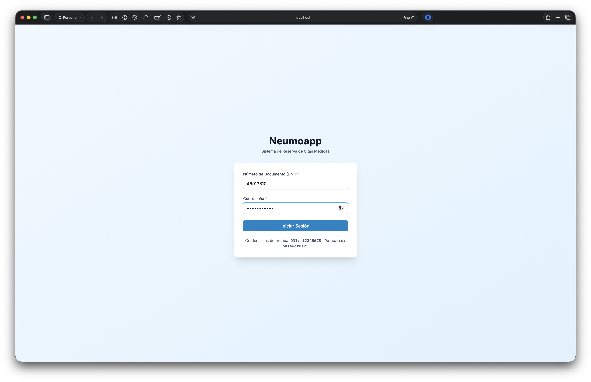

---

#### PF-AUTH-002 — Inicio de sesión con credenciales inválidas

| Atributo | Detalle |
|----------|---------|
| **Objetivo** | Comprobar que el sistema rechaza credenciales incorrectas sin filtrar información sensible. |
| **Prioridad** | Alta |
| **Tipo** | Negativo |
| **Referencias** | `POST /auth/login`; `/login`. |

**Precondiciones**

1. Mismas que PF-AUTH-001 respecto a servicios activos.
2. No es necesario usuario válido para la contraseña usada; sí debe existir el flujo de error.

**Datos de entrada**

| Campo | Valor sugerido |
|--------|----------------|
| Documento | `12345678` |
| Contraseña | `claveIncorrecta123!` |

**Pasos detallados**

1. Ir a `/login`.
2. Ingresar documento existente pero contraseña incorrecta (o documento inexistente, según segunda variante que quieras evidenciar).
3. Enviar el formulario.
4. Leer el mensaje mostrado al usuario (toast, texto en pantalla, etc.).

**Criterios de éxito**

- No se accede al dashboard como usuario autenticado válido.
- Mensaje de error comprensible (genérico o específico según política del producto).
- No se expone información interna de la base de datos (p. ej. stack trace en producción).

**Criterios de fallo**

- Acceso concedido con contraseña errónea.
- Error HTTP 500 sin manejo en cliente.

**Postcondiciones**

- Ninguna cita ni dato persistente debería crearse por este intento.

**Resultado obtenido (ejecución):** APROBADO — Tras credenciales incorrectas, la UI permanece en login y se muestra el toast de error sin acceder al dashboard.

**Evidencia (adjunto):**

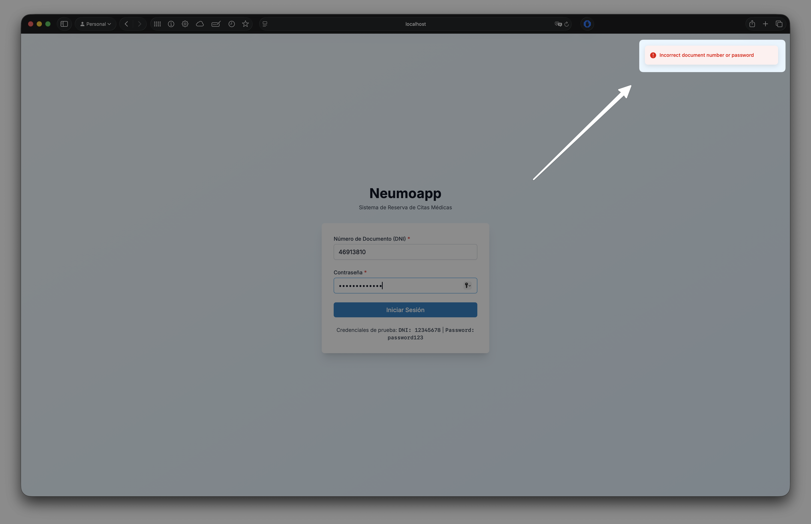

---

#### PF-AUTH-003 — Acceso a recurso protegido sin token

| Atributo | Detalle |
|----------|---------|
| **Objetivo** | Verificar que la API exige autenticación para operaciones del paciente autenticado. |
| **Prioridad** | Alta |
| **Tipo** | Negativo |
| **Referencias** | `GET /auth/me` (perfil del paciente autenticado); opcional `GET /patients/me` o `GET /hospitals` si el SUT los expone con la misma política. |

**Precondiciones**

1. API levantada.
2. No enviar cabecera `Authorization` ni cookies de sesión que reemplacen al Bearer.

**Pasos detallados**

1. Desde Swagger o cliente HTTP, invocar `GET /auth/me` sin token.
2. Opcional: repetir con otros endpoints protegidos (p. ej. `GET /hospitals`) según tu despliegue.
3. Anotar código HTTP y cuerpo de error.

**Criterios de éxito**

- Respuesta de error por no autenticado (p. ej. **401 Unauthorized** o **403 Forbidden** con mensaje tipo `Not authenticated`, según FastAPI/dependencias del SUT).
- Mensaje de error coherente en JSON si el framework lo estandariza.

**Criterios de fallo**

- 200 con datos sensibles sin autenticación.

**Postcondiciones**

- Ninguna.

**Resultado obtenido (ejecución):** APROBADO — En Swagger, `GET /auth/me` sin token devuelve **403 Forbidden** con cuerpo `{"detail":"Not authenticated"}`; no se devuelve el perfil del paciente.

**Evidencia (adjunto):**

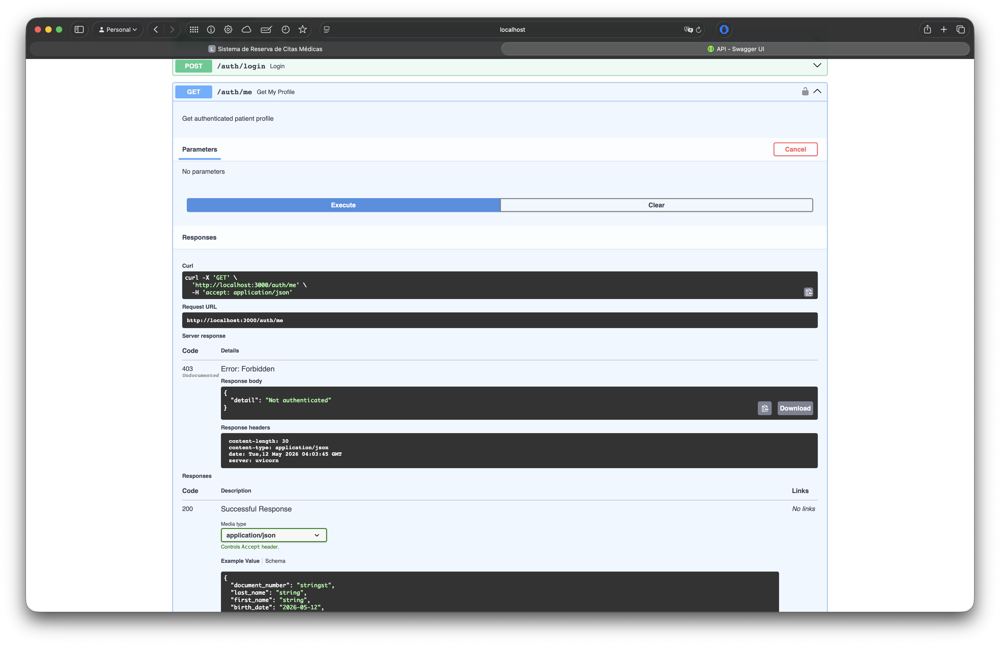

---

#### PF-AUTH-004 — Registro de nuevo paciente vía API

| Atributo | Detalle |
|----------|---------|
| **Objetivo** | Validar alta de paciente con payload válido y cumplimiento del esquema Pydantic. |
| **Prioridad** | Media |
| **Tipo** | Positivo |
| **Referencias** | `POST /auth/register`; `service/README.md` ejemplo de cuerpo. |

**Precondiciones**

1. `document_number` y `email` del payload **no** existen ya en la tabla `patients`.
2. API accesible.

**Datos de entrada**

Usar un JSON válido; ejemplo (modificar números/email para unicidad):

```json
{
  "document_number": "99999991",
  "last_name": "Prueba",
  "first_name": "Funcional",
  "birth_date": "1990-01-15",
  "gender": "M",
  "phone": "999000111",
  "email": "funcional.test+99999991@example.com",
  "address": "Av. Test 123",
  "password": "TestPass123"
}
```

**Pasos detallados**

1. Enviar `POST /auth/register` con `Content-Type: application/json`.
2. Verificar código HTTP de creación exitosa según implementación (habitualmente 201 o 200).
3. Ejecutar `POST /auth/login` con el nuevo documento y contraseña para confirmar que el usuario puede autenticarse.

**Criterios de éxito**

- Usuario creado y login posterior exitoso.
- La respuesta de registro **no** incluye `password_hash` ni contraseña en claro.

**Criterios de fallo**

- 422 por validación incorrecta cuando el JSON es válido.
- Duplicado silencioso o error 500.

**Postcondiciones**

- Opcional: desactivar o eliminar el usuario de prueba si el proceso de limpieza lo requiere (no documentado por defecto en el repo).

**Resultado obtenido (ejecución):** APROBADO — `POST /auth/register` respondió **201 Created** con el paciente creado (`id`, datos coincidentes con el payload); la respuesta **no** incluye contraseña ni hash.

**Evidencia (adjunto):**

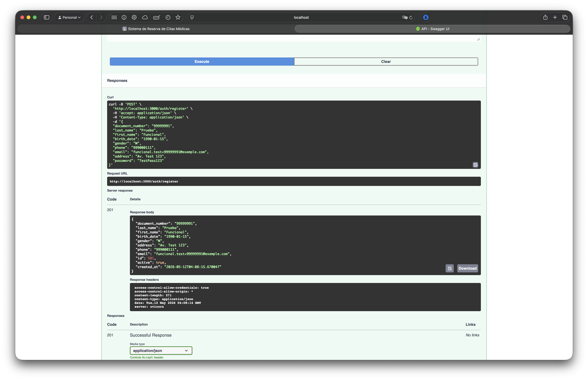

---

### 7.2 Navegación y rutas protegidas (cliente)

#### PF-NAV-001 — Intento de acceso a ruta protegida sin sesión

| Atributo | Detalle |
|----------|---------|
| **Objetivo** | Comprobar que `ProtectedRoute` redirige al login cuando no hay sesión. |
| **Prioridad** | Alta |
| **Tipo** | Negativo |
| **Referencias** | `ProtectedRoute`; rutas bajo `MainLayout`. |

**Precondiciones**

1. Sin sesión (ventana privada o tras logout).

**Pasos detallados**

1. Abrir directamente `{URL_CLIENTE}/dashboard` o `/agendar-cita`.
2. Observar URL final y pantalla mostrada.

**Criterios de éxito**

- Redirección a `/login` (o comportamiento documentado equivalente).
- No se muestran datos de citas u hospitales sin autenticación.

**Resultado obtenido (ejecución):** APROBADO — Sin sesión, al acceder a `/dashboard` o `/agendar-cita` la app redirige a `/login` y no se exponen datos de citas ni catálogo autenticado.

**Evidencia (adjunto):** Caso aprobado en prueba manual; comentario de aceptación registrado.

---

#### PF-NAV-002 — Navegación entre módulos con sesión activa

| Atributo | Detalle |
|----------|---------|
| **Objetivo** | Validar que el usuario puede moverse entre Dashboard, Agendar, Mis citas y Asistente sin perder sesión. |
| **Prioridad** | Media |
| **Tipo** | Positivo |

**Precondiciones**

1. Sesión iniciada.

**Pasos detallados**

1. Desde el menú lateral o superior, visitar en orden: Dashboard → Agendar cita → Mis citas → Asistente.
2. En cada pantalla, verificar que carga sin error visible y que la ruta en el navegador coincide (`/dashboard`, `/agendar-cita`, `/mis-citas`, `/asistente`).

**Criterios de éxito**

- Ninguna pantalla muestra error de aplicación no capturado.
- No se fuerza re-login entre navegaciones normales.

**Resultado obtenido (ejecución):** APROBADO — Con sesión activa se navegó por Dashboard, Agendar cita, Mis citas y Asistente; cada vista cargó correctamente y las URLs coincidieron con las rutas esperadas, sin pérdida de sesión.

**Evidencia (adjunto):** Capturas por ruta (misma sesión de prueba).

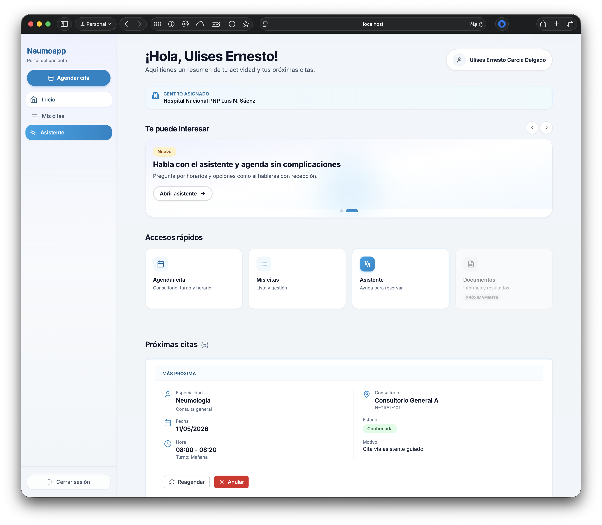

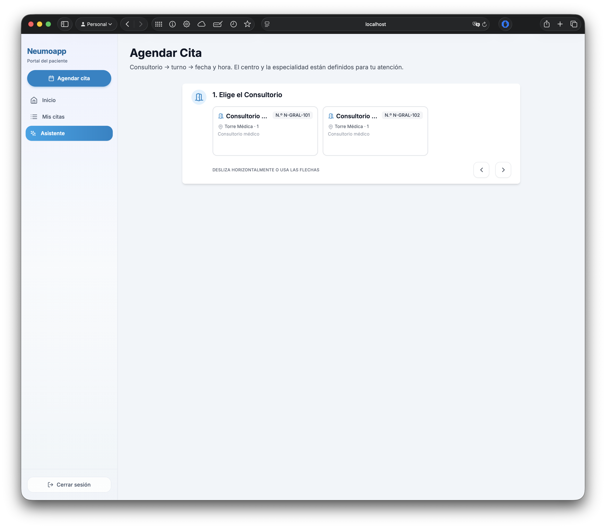

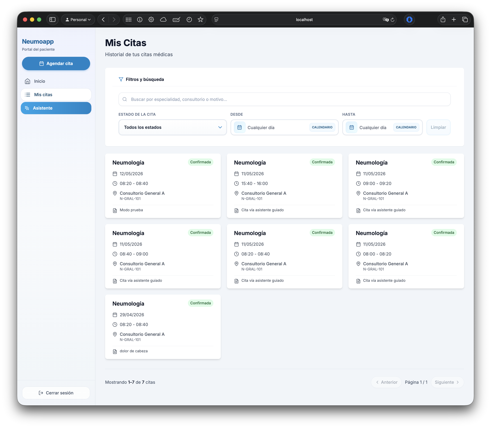

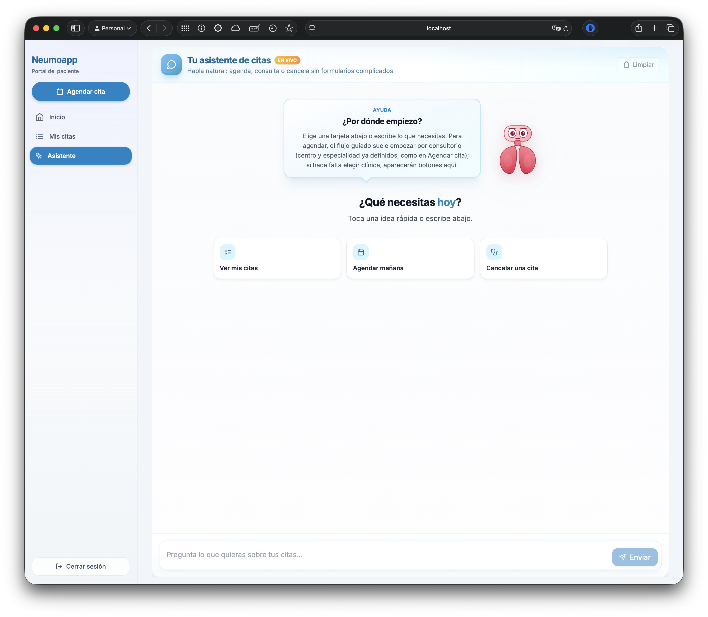

---

### 7.3 Perfil del paciente

#### PF-PAT-001 — Consultar perfil propio (`GET /patients/me`)

| Atributo | Detalle |
|----------|---------|
| **Objetivo** | Verificar lectura del perfil del token JWT actual. |
| **Prioridad** | Alta |
| **Tipo** | Positivo |
| **Referencias** | `GET /patients/me`. |

**Precondiciones**

1. Token válido obtenido por login.

**Pasos detallados**

1. Llamar `GET /patients/me` con `Authorization: Bearer <token>`.
2. Comparar `document_number`, nombres y email con el usuario esperado.

**Criterios de éxito**

- Código 200.
- Cuerpo coherente con el paciente autenticado.
- Ausencia de campos de contraseña o hash.

**Resultado obtenido (ejecución):** APROBADO — El perfil del paciente autenticado se muestra correctamente (modal **Mi cuenta** en el portal); los datos coinciden con el usuario en sesión y no se expone contraseña ni hash.

**Evidencia (adjunto):**

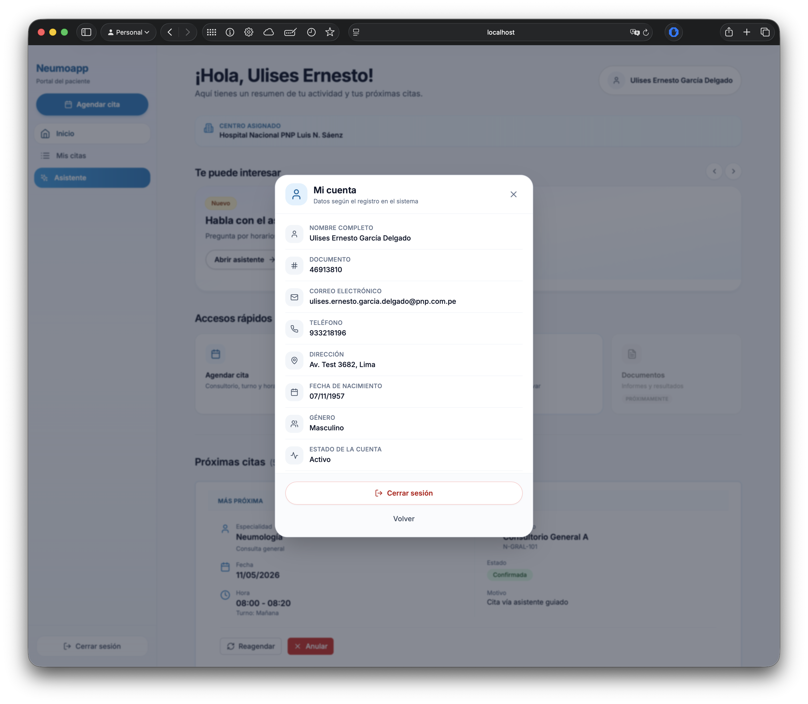

---

### 7.5 Disponibilidad de turnos (slots)

#### PF-SLOT-001 — Slots en turno mañana

| Atributo | Detalle |
|----------|---------|
| **Objetivo** | Obtener la grilla de intervalos para una fecha y turno `morning`. |
| **Prioridad** | Alta |
| **Tipo** | Positivo |
| **Referencias** | `GET /slots/available`; parámetros `hospital_id`, `specialty_id`, `date`, `shift`. |

**Precondiciones**

1. Par hospital + especialidad válidos.
2. Fecha futura dentro de reglas del sistema (día laborable si aplica lógica de fines de semana).

**Pasos detallados**

1. Construir la URL con `shift=morning` y fecha `YYYY-MM-DD`.
2. Revisar la respuesta: cada slot debe indicar si está `available` u ocupado según la lógica documentada (README: slots de 20 minutos, ventana mañana).
3. Anotar un `start_time` con `available: true` para usar en PF-APT-002.

**Criterios de éxito**

- Código 200.
- Lista de slots no vacía para combinaciones válidas en datos sembrados (si no hay, documentar como “sin disponibilidad” y adjuntar evidencia de mensaje o lista vacía explícita).

**Criterios de fallo**

- 500 o formato JSON inutilizable para la UI.

**Resultado obtenido (ejecución):** APROBADO — En el flujo de agendamiento, con consultorio **N-GRAL-102**, turno **mañana** (8:00–13:00) y fecha **12/05/2026**, la UI muestra **15** horarios disponibles en intervalos de 20 minutos (p. ej. **08:00**, **08:20**, **09:20** libres para selección).

**Evidencia (adjunto):**

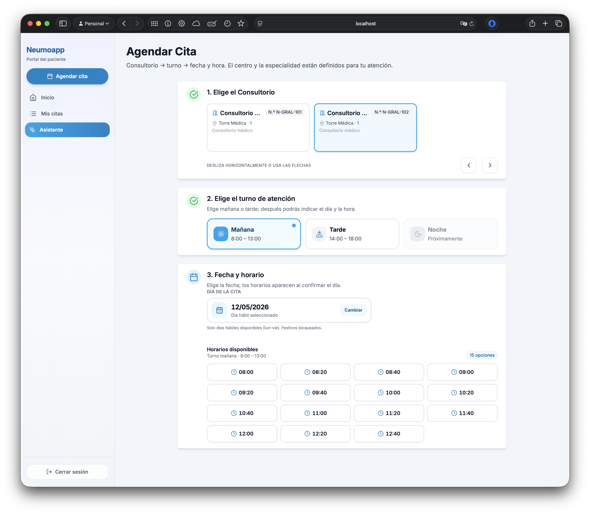

---

#### PF-SLOT-002 — Slots en turno tarde

| Atributo | Detalle |
|----------|---------|
| **Objetivo** | Mismo que PF-SLOT-001 para `shift=afternoon`. |
| **Prioridad** | Alta |
| **Tipo** | Positivo |

**Pasos y criterios** | Análogos a PF-SLOT-001 con `afternoon`.

**Resultado obtenido (ejecución):** APROBADO — Con consultorio **N-GRAL-102**, turno **tarde** (14:00–18:00) y fecha **13/05/2026**, la UI muestra **12** horarios disponibles en intervalos de 20 minutos (p. ej. **14:00**, **15:20**, **17:40**).

**Evidencia (adjunto):**

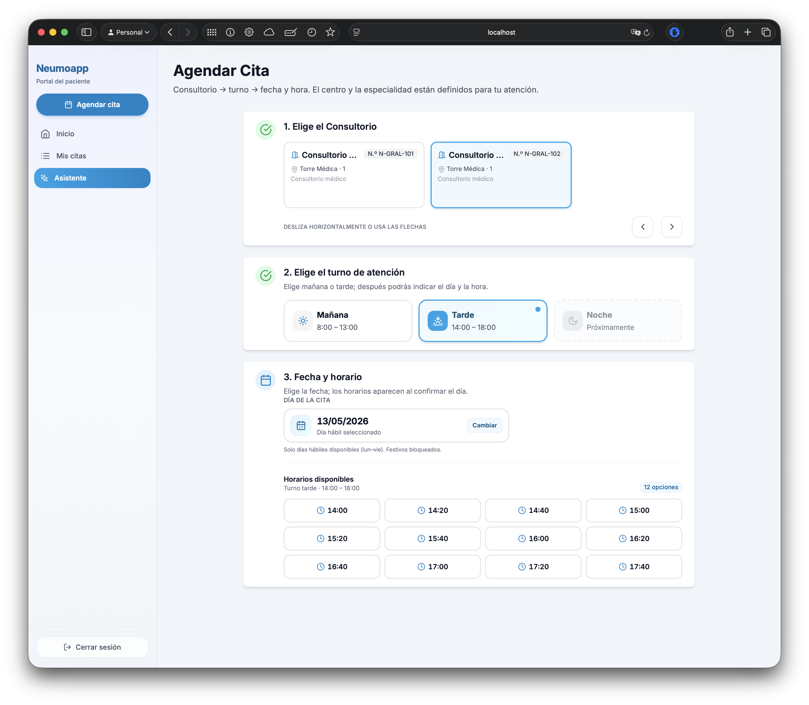

---

### 7.7 Reserva end-to-end en cliente web

#### PF-UI-001 — Flujo completo “Agendar cita”

| Atributo | Detalle |
|----------|---------|
| **Objetivo** | Demostrar el flujo visual hospital → especialidad → fecha/turno → confirmación en `/agendar-cita`. |
| **Prioridad** | Alta |
| **Tipo** | Positivo |
| **Referencias** | `BookAppointment.jsx`; llamadas encadenadas a API descritas en README. |

**Precondiciones**

1. Sesión iniciada.
2. Existencia de datos sembrados que permitan completar el flujo sin error.

**Pasos detallados**

1. Ir a `/agendar-cita`.
2. Seleccionar hospital de la lista (capturar nombre e id si la UI lo muestra).
3. Seleccionar especialidad entre las ofrecidas para ese hospital.
4. Elegir consultorio si la UI lo pide o deducirlo del flujo.
5. Elegir fecha y turno (mañana/tarde) según controles de la pantalla.
6. Elegir un bloque horario marcado como libre.
7. Confirmar la reserva y leer mensaje de éxito (toast o pantalla de confirmación).

**Criterios de éxito**

- Mensaje de confirmación explícito.
- En Network se observa `POST /appointments` con 2xx y cuerpo con id de cita.

**Pasos de verificación cruzada**

1. Navegar a `/mis-citas` y localizar la cita creada con misma fecha y especialidad.

**Resultado obtenido (ejecución):** APROBADO — Flujo en `/agendar-cita` hasta el paso final: consultorio **N-GRAL-102**, turno **tarde**, fecha **13/05/2026**, horario **14:20 – 14:40**, especialidad **Neumología**, motivo **Test pruebas**; el modal **Confirmar Cita** muestra el mismo resumen que las selecciones en pantalla.

**Evidencia (adjunto):**

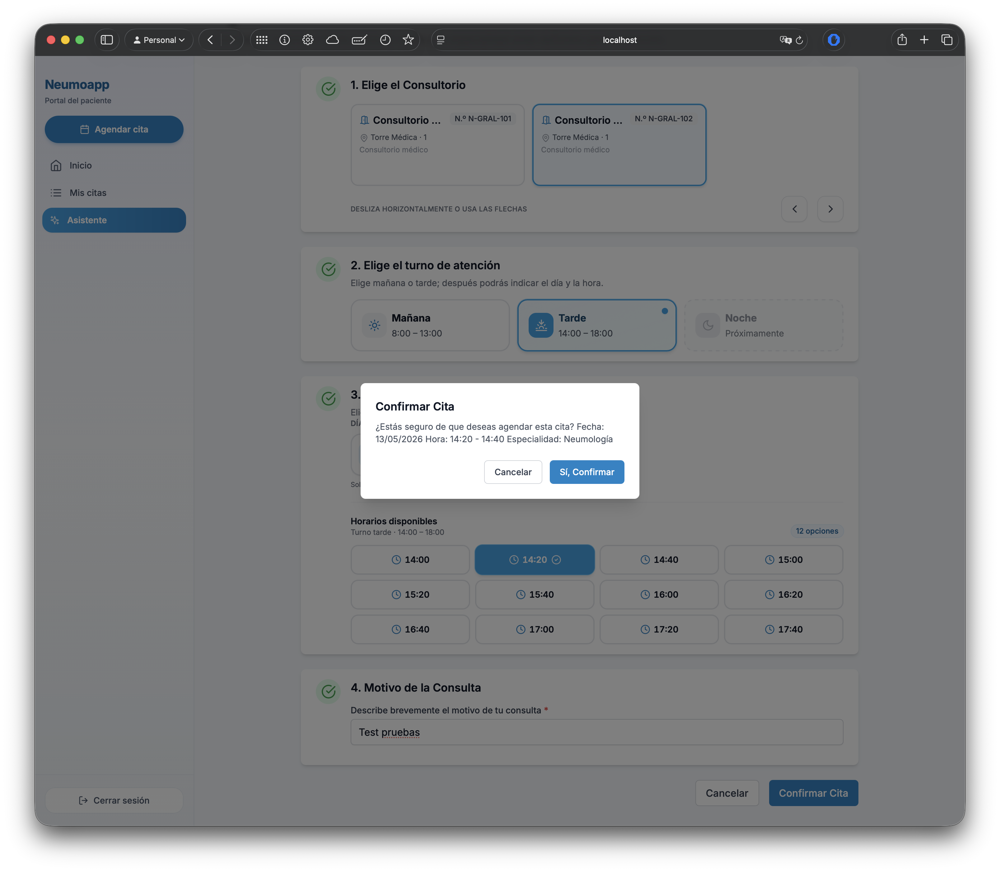

---

#### PF-UI-002 — Consulta y cancelación desde “Mis citas”

| Atributo | Detalle |
|----------|---------|
| **Objetivo** | Evidenciar gestión de citas desde la UI. |
| **Prioridad** | Alta |
| **Tipo** | Positivo |

**Precondiciones**

1. Al menos una cita futura listada para el usuario (creada por PF-UI-001 o por API).

**Pasos detallados**

1. Abrir `/mis-citas`.
2. Identificar la tarjeta o fila de la cita de prueba.
3. Ejecutar la acción de cancelar o ver detalle según lo que implemente la pantalla.
4. Confirmar en UI el cambio de estado o desaparición de la cita de la lista de activas.

**Criterios de éxito**

- La UI refleja el mismo estado que `GET /appointments/my-appointments` tras refrescar.

**Resultado obtenido (ejecución):** APROBADO — Desde el portal (cita próxima en inicio/dashboard), al pulsar **Anular** sobre una cita **Confirmada** (ej. Neumología, 11/05/2026, 08:00–08:20, Consultorio General A), la aplicación muestra el diálogo **«¿Estás seguro de que deseas cancelar esta cita?»** con opciones para desistir o confirmar la anulación.

**Evidencia (adjunto):**

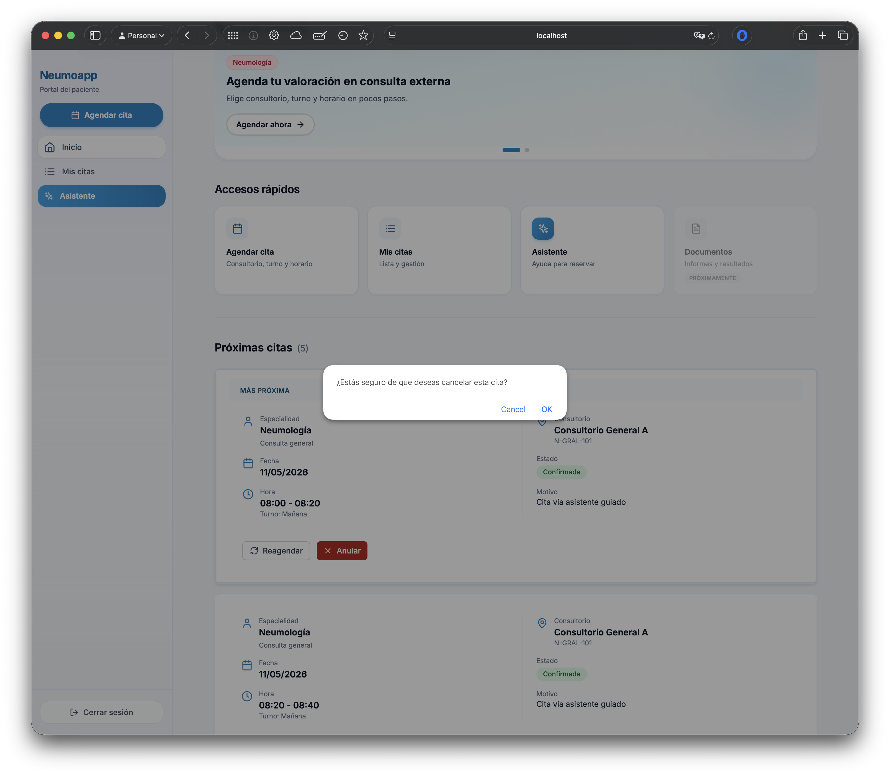

---

### 7.8 Asistente de chat

#### PF-CHAT-001 — Envío de mensaje y respuesta del asistente

| Atributo | Detalle |
|----------|---------|
| **Objetivo** | Verificar el endpoint de chat y la experiencia mínima en `/asistente`. |
| **Prioridad** | Media (Alta si el curso exige IA obligatoria) |
| **Tipo** | Positivo |
| **Referencias** | `chat_router`; `openai_chat_service`; variables `OPENAI_*` y `APP_TIMEZONE` en configuración. |

**Precondiciones**

1. Variables de entorno configuradas para un proveedor compatible (OpenAI, Ollama, Gemini en modo compatible, etc.).
2. Sesión de paciente iniciada si el endpoint exige autenticación.

**Pasos detallados**

1. Abrir `/asistente`.
2. Enviar un mensaje corto y claro (ej. “¿Qué especialidades hay en el hospital X?” o saludo + pregunta sobre citas).
3. Esperar respuesta del asistente.
4. Revisar Network: petición al backend con 2xx y cuerpo con texto de respuesta o estructura acordada.

**Criterios de éxito**

- Sin error 500 en cadena completa cliente → API → proveedor LLM.
- Respuesta legible y sin filtrar secretos (.env, claves).

**Criterios de fallo**

- Timeout sin mensaje al usuario.
- Exposición de trazas internas en UI.

**Resultado obtenido (ejecución):** APROBADO — En `/asistente`, con mensaje en lenguaje natural (p. ej. agendar cita para el **15 de mayo**), el asistente responde sin error 500, identifica **Hospital Nacional PNP Luis N. Sáenz** y **Neumología**, confirma la fecha (**15/05/2026**) y ofrece **respuestas rápidas** (consultorios y franjas horarias 08:00–17:40). **Proveedor LLM:** el configurado en el ambiente (`OPENAI_*` en `.env`; p. ej. OpenAI, Gemini compatible u Ollama).

**Evidencia (adjunto):**

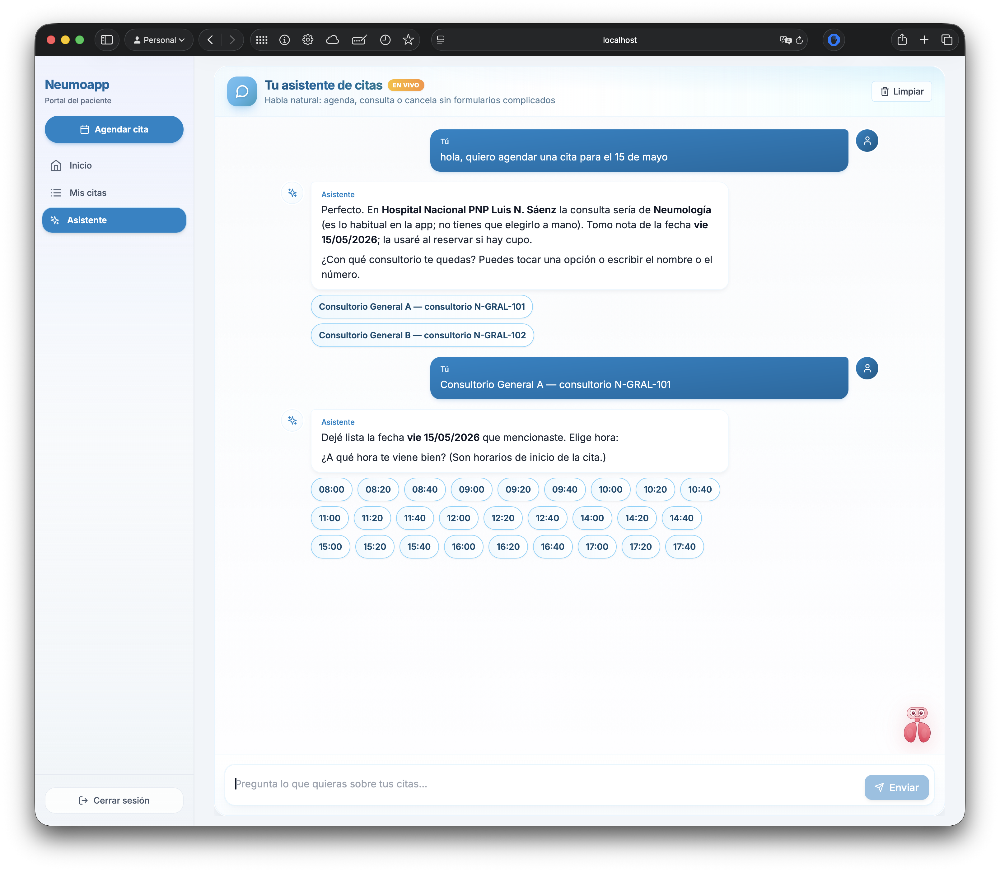

---

#### PF-CHAT-002 — Asistente con herramientas (consulta de citas o disponibilidad)

| Atributo | Detalle |
|----------|---------|
| **Objetivo** | Evidenciar que el modelo puede disparar **tool calls** y el backend responde con datos reales. |
| **Prioridad** | Media |
| **Tipo** | Positivo |
| **Referencias** | `ChatToolExecutor`; herramientas definidas en el servicio de chat. |

**Precondiciones**

1. Mismo que PF-CHAT-001.
2. Usuario con historial de citas o contexto conocido para una pregunta verificable.

**Pasos detallados**

1. Formular una petición que fuerce consulta estructurada (ej. “¿Cuáles son mis próximas citas?” o “¿Hay disponibilidad mañana en la mañana para cardiología en el hospital Y?” — ajustar redacción a lo que el prompt del sistema soporte).
2. Verificar en la respuesta datos que coincidan con `GET /appointments/upcoming` o slots obtenidos manualmente.

**Criterios de éxito**

- Coherencia entre respuesta del asistente y datos de la API (no inventar citas inexistentes cuando el tool devuelve lista vacía).

**Resultado obtenido (ejecución):** APROBADO — Ante la pregunta **«¿Qué citas tengo programadas?»**, el asistente devuelve una lista **enumerada de citas** con fecha, hora, especialidad (Neumología), consultorio y motivo, alineada con el historial del paciente (evidencia con **6** ítems en la captura).

**Evidencia (adjunto):**

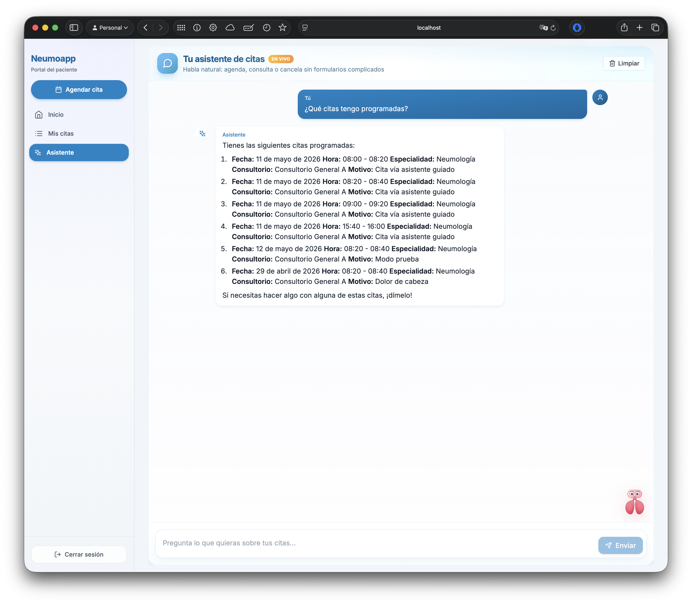

---

### 7.9 Contrato API, salud y documentación

#### PF-API-001 — Documentación Swagger (`/docs`)

| Atributo | Detalle |
|----------|---------|
| **Objetivo** | Comprobar que la especificación interactiva está publicada y alineada con routers montados en `main.py`. |
| **Prioridad** | Media |
| **Tipo** | Positivo |

**Pasos detallados**

1. Abrir `{URL_API}/docs`.
2. Verificar presencia de tags: autenticación, pacientes, hospitales, especialidades, consultorios, slots, citas, chat (nombres exactos pueden variar).
3. Expandir al menos un endpoint y ejecutar “Try it out” con parámetros mínimos (p. ej. `/health`).

**Resultado obtenido (ejecución):** APROBADO — Swagger UI accesible en `/docs`: título **Neumoapp API** (v1.0.0, OAS 3.1), descripción del sistema y listado de operaciones por tags (**Authentication**, **Patients**, **Specialties**, **hospitals**, etc.), con botón **Authorize** para JWT.

**Evidencia (adjunto):**

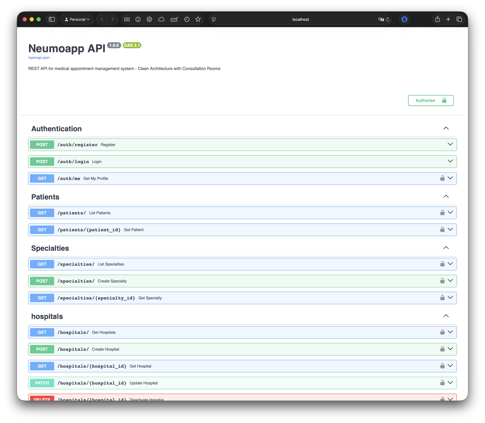

---

## 8. Matriz resumen de cobertura

| Módulo | IDs incluidos | Cantidad | Evidencias adjuntas (conteo) |
|--------|----------------|----------|------------------------------|
| Autenticación y sesión | PF-AUTH-001 a 004 y 006 | 5 | _Completar_ |
| Navegación cliente | PF-NAV-001 … 002 | 2 | _Completar_ |
| Perfil paciente | PF-PAT-001 … 002 | 2 | _Completar_ |
| Catálogo | PF-CAT-001 … 005 | 5 | _Completar_ |
| Slots | PF-SLOT-001 … 004 | 4 | _Completar_ |
| Citas (API) | PF-APT-001 … 007 | 7 | _Completar_ |
| Cliente web | PF-UI-001 … 003 | 3 | _Completar_ |
| Asistente | PF-CHAT-001 … 003 | 3 | _Completar_ |
| API / salud | PF-API-001 … 003 | 3 | _Completar_ |
| **Total** | | **34** | _Completar_ |

**Leyenda de estado global (opcional)**

| Código | Significado |
|--------|-------------|
| APROBADO | Criterios de éxito cumplidos en la última corrida documentada. |
| FALLIDO | Incumplimiento; registrar incidencia y evidencia. |
| BLOQUEADO | No ejecutable por dependencia externa (ej. LLM sin cuota). |
| N/A | No aplica al entrega académica o contrato. |

---

## 9. Firmas

| Rol | Nombre | Organización | Fecha | Firma / comentario |
|-----|--------|--------------|-------|---------------------|
| Ejecutor de pruebas | | | | |
| Revisión técnica | | | | |
| Aprobación (PO / tutor) | | | | |
